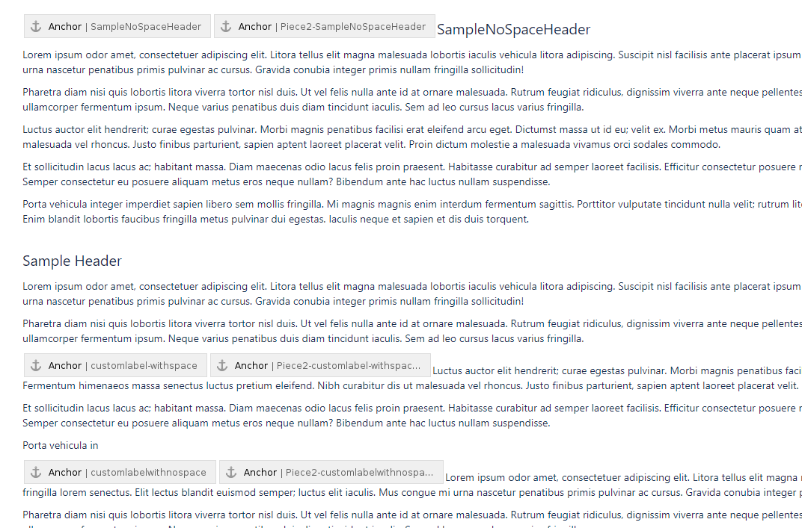

# Purpose
This repository aims to reproduce the behaviour explained in the issue [1057](https://github.com/sphinx-contrib/confluencebuilder/issues/1057)


## Run performed :

```shell
sphinx-build --builder confluence ./docs/ docs/build/ --fresh-env --write-all --color --warning-file ./warns.log
```


```shell
Running Sphinx v8.1.3
loading translations [en]... done
building [mo]: all of 0 po files
writing output...
building [confluence]: all source files
updating environment: [new config] 3 added, 0 changed, 0 removed
reading sources... [100%] test_folder/piece2
looking for now-outdated files... none found
pickling environment... done
checking consistency... done
preparing documents... done
copying assets...
copying assets: done
writing output... [100%] test_folder/piece2
publishing documents... [ 33%] index
querying for descendants... done
querying for attachments... [100%] 241697411
publishing documents... [100%] test_folder/piece2
building intersphinx... done
publishing assets...
Publish point: xxxxxxxxxx-redacted-xxxxxxxxx
build succeeded.

```

## Issue suposed

hyperlink to section title containing space are not properly shaped

